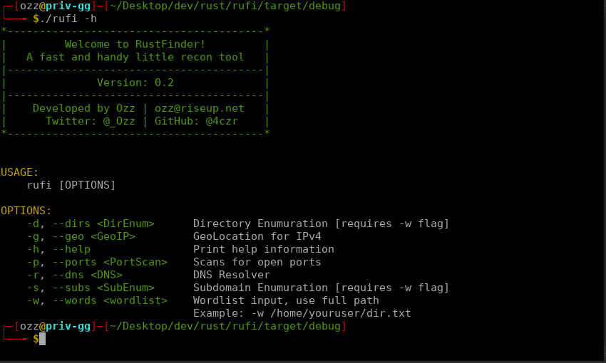

# Welcome to RuFi 
RustFinder is a fast web application reconnaissance tool written in Rust for ethical hackers. The purpose was to have a project to start learning rust that could also perhaps help other people. I'm not saying you should use this over any of the other clearly better solutions out there, however some people may find a use for it :) I welcome any and all comments. I plan to work on this frequently.



Twitter @_Ozz

Github @4czr

Email ozz@riseup.net

# Use
```
    -d, --dirs <DirEnum>      Directory Enumuration [requires -w flag]
    -g, --geo <GeoIP>         GeoLocation for IPv4
    -h, --help                Print help information
    -p, --ports <PortScan>    Scans for open ports
    -r, --dns <DNS>           DNS Resolver
    -s, --subs <SubEnum>      Subdomain Enumuration [requires -w flag]
    -w, --words <wordlist>    Wordlist input, use full path
                              Example: -w /home/youruser/dir.txt


```

# Version
**0.2 [ALPHA]**

# What's To Come?
- Progress Bars
- Spider
- Technology Stack Detection

# Documentation
Directory Enumeration
```./rufi -d https://127.0.0.1 -w /home/youruser/dirlist.txt```

Sub Domain Enumeration
```./rufi -s https://127.0.0.1 -w /home/youruser/sublist.txt```

Port Scanner
```./rufi -p 127.0.0.1```

DNS Resolver
```./rufi -r https://127.0.0.1```

GeoIP Location
```./rufi -g 127.0.0.1```

# License
Open Source/Creative Commons license - You may use/change/edit/recreate this software anyway you like. It's completely free to use, all I ask is you give me a star :)

# Changelog
21/04/2022: 0.2 released, port scanner added
